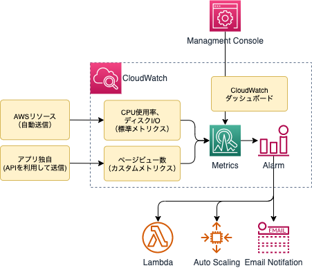

[戻る](../README.md)
## 第2章 モニターリング、ロギング、修復

[2-1 AWSのモニタリング及びロギングサービスの概要](#2-1)
- メトリクスの監視  
- ログの監視  
- イベントの監視  

[2-2 Amazon ClousWatch](#2-2)

[2-3 AWS CloudTrail](#2-3)

[2-4 AWS Config](#2-4)

[2-5 AWS Personal Heath Dashboard](#2-5)

### 2-1_AWSのモニタリング及びロギングサービスの概要

| モニタリング・ロギング対象  | AWSサービス |
| ------------- | ------------- |
| AWSリソースの使用状況  | Amazon CloudWatch  |
| AWSのAPI実行状況  | AWS CloudTrail  |
| AWSリソースの設定状況  | AWS Config  |
| AWSイベントの予定・状況  | AWS Personal Health Dashboard  |

そのなか、一番重要なのは`CloudWatch`です。

### 2-2_Amazon CloudWatch

CloudWatchが収集・可視化・障害検知を行う対象データは以下に分類されます。
- メトリクス
- ログ
- イベント

**メトリクスの監視**

### 2-3_AWS CloudTrail
a  
a  
a  
a  
a  
a  
a  

### 2-4_AWS Config
a  
a  
a  
a  
a  
a  
a  

### 2-5_AWS Personal Heath Dashboard
a  
a  
a  
a  
a  
a  
a  

 

-----