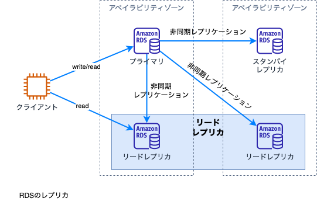

[戻る](../README.md)
## 第3章 信頼性とビジネス継続性

[3-1 ユースケースに応じた拡張性と伸縮性の実現](#3-1)

- AWS Auto Scalingプランの作成と維持
- キャッシングの実装
- Amazon RDSレプリカとAmazon Auroraレプリカの実装
- 疎結合アーキテクチャの実装
- 水平方向のスケーリングと垂直方向のスケーリングの区別

[3-2 高可用性と耐障害性のある環境の構築](#3-2)

- ELBとRoute53のヘルスチェックの設定
- 単一のAZの使用とマルチAZのデプロイメントの違い
- フォールトトレラントなワークロードの実装
- Route53ルーティングポリシーの実装

[3-3 バックアップ・リストア戦略の導入](#3-3)
- ユースケースにもとづいたスナップショットとバックアップの自動化
- データベースのリストア
- バージョニングとライフサイクルルールの実装
- Amazon S3クロスリージョンレプリケーションの設定
- 災害復旧手順の実行

-----

### 3-1 ユースケースに応じた拡張性と伸縮性の実現

**AWS Auto Scalingプランの作成と維持**

Auto Scalingには次の３種類があります。
- AWS Auto Scaling
- Amaozn EC2 Auto Scaling
- Applicaiton Auto Scaling

それぞれの違いは次の２点です。
- スケーリングのオプション
- スケーリング対象

この３つの関係性を示したものが次の図です。  

ELBとの関係

Auto ScalingとALBとの関係  

**キャッシングの実装**

キャッシングが行えるAWSサービスには下記があります。
- Amazon ElastiCache
- Amazon DynamoDB Accelerator(DAX)
- Amazon CloudFront
- Amazon MemoryDB

ElastiCacheの概要  

ElastiCacheのスケーリング

Memcachedのスケーリング  

Redisのスケール  

ElastiCacheの障害時の挙動  

**Amazon RDSレプリカとAmazon Auroraレプリカの実装**

レプリカ

RDSのレプリカ  

**疎結合アーキテクチャの実装**

**水平方向のスケーリングと垂直方向のスケーリングの区別**

### 3-2 高可用性と耐障害性のある環境の構築

- ELBとRoute53のヘルスチェックの設定
- 単一のAZの使用とマルチAZのデプロイメントの違い
- フォールトトレラントなワークロードの実装
- Route53ルーティングポリシーの実装

### 3-3 バックアップ・リストア戦略の導入

- ユースケースにもとづいたスナップショットとバックアップの自動化
- データベースのリストア
- バージョニングとライフサイクルルールの実装
- Amazon S3クロスリージョンレプリケーションの設定
- 災害復旧手順の実行

 

-----