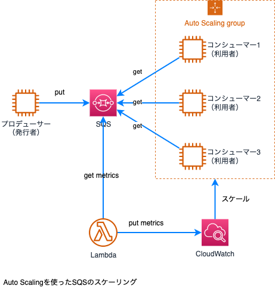
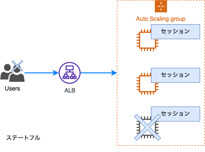

[戻る](../README.md)
## 第3章 信頼性とビジネス継続性

[3-1 ユースケースに応じた拡張性と伸縮性の実現](#3-1)

- [AWS Auto Scalingプランの作成と維持](#3-1-1)
- [キャッシングの実装](#3-1-2)
- [Amazon RDSレプリカとAmazon Auroraレプリカの実装](#3-1-3)
- [疎結合アーキテクチャの実装](#3-1-4)
- [水平方向のスケーリングと垂直方向のスケーリングの区別](#3-1-5)

[3-2 高可用性と耐障害性のある環境の構築](#3-2)

- ELBとRoute53のヘルスチェックの設定
- 単一のAZの使用とマルチAZのデプロイメントの違い
- フォールトトレラントなワークロードの実装
- Route53ルーティングポリシーの実装

[3-3 バックアップ・リストア戦略の導入](#3-3)
- ユースケースにもとづいたスナップショットとバックアップの自動化
- データベースのリストア
- バージョニングとライフサイクルルールの実装
- Amazon S3クロスリージョンレプリケーションの設定
- 災害復旧手順の実行

-----

### 3-1 ユースケースに応じた拡張性と伸縮性の実現

**AWS Auto Scalingプランの作成と維持**

Auto Scalingには次の３種類があります。
- AWS Auto Scaling
- Amaozn EC2 Auto Scaling
- Applicaiton Auto Scaling

それぞれの違いは次の２点です。
- スケーリングのオプション
- スケーリング対象

この３つの関係性を示したものが次の図です。  

ELBとの関係

Auto ScalingとALBとの関係  

**キャッシングの実装**

キャッシングが行えるAWSサービスには下記があります。
- Amazon ElastiCache
- Amazon DynamoDB Accelerator(DAX)
- Amazon CloudFront
- Amazon MemoryDB

ElastiCacheの概要  

ElastiCacheのスケーリング

Memcachedのスケーリング  

Redisのスケール  

ElastiCacheの障害時の挙動  

**Amazon RDSレプリカとAmazon Auroraレプリカの実装**

レプリカ

RDSのレプリカ  

AuroraのリードレプリカはAWS Auto Scalingでオートスケーリングが可能で、
次のメトリクスが利用可能です。
- CPU使用率
- 平均接続数

**疎結合アーキテクチャの実装**

Amazon SQS

疎結合アーキテクチャを代表するAWSサービスの１つは**Amazon SQS**です。
Amazon SQSは、フルマネージドなメッセージキューイングサービスで、分散されたシステム間で非同期メッセージが行えるキューを提供します。

重い処理などを実行したい場合、タスクを分割してSQSへキューを送信し、それを複数のコンシューマーが処理するようなスケーリングも可能になります。

コンシューマーのスケーリングはAWS Auto Scalingで可能です。  
キュー数などのメトリクスを取得し、その値をカスタムメトリクスとして、CloudWatchに入れるアプリケーションを作成することで可能になります。

**水平方向のスケーリングと垂直方向のスケーリングの区別**

**垂直スケーリング**とは、CPUやメモリなどのリソースのスペックを変更する方法で、スペックを上げることをスケールアップ、スペックを下げることをスケールダウンと呼びます。

**水平スケーリング**とは、リソースの数を増減する方法で、増やすことをスケーリングアウト、減らすことをスケールインと呼びます。

一般的には、スケートフルなアプリケーションは水平スケーリングではなく、垂直スケーリングがすすめられている。

例えば、サーバ内にログイン情報などのセッション情報を持っている場合を考えます。もし、スケールインで設計すると、auto scalingが収束時、自動でダウンされますので、そのインスタンス内に保存した情報が失ってしまいます。

対処法として、ステートフルになっているセッション情報をスケーリングの外にあるElastiCacheへ出して上げることが考えられます。これにより、サーバーはステートレスとなるため、水平スケーリングが可能になります。

### 3-2 高可用性と耐障害性のある環境の構築

- ELBとRoute53のヘルスチェックの設定
- 単一のAZの使用とマルチAZのデプロイメントの違い
- フォールトトレラントなワークロードの実装
- Route53ルーティングポリシーの実装

### 3-3 バックアップ・リストア戦略の導入

- ユースケースにもとづいたスナップショットとバックアップの自動化
- データベースのリストア
- バージョニングとライフサイクルルールの実装
- Amazon S3クロスリージョンレプリケーションの設定
- 災害復旧手順の実行

 

-----