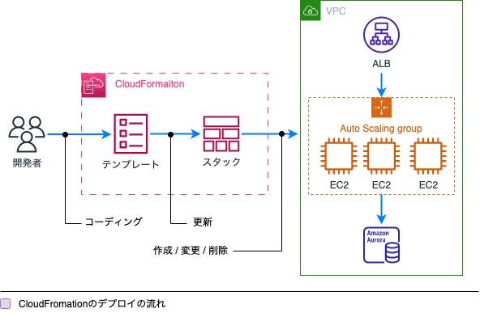

[戻る](../README.md)
### 第4章 展開、プロビジョニング、オートメーション

4-1 クラウドリソースのプロビジョニングとメンテナンス
- AMIの作成と管理
- [AWS CloudFormationの作成、管理、およびトラブルシューティング](#4-1-2)
- 複数のAWSリージョンとアカウントにまたがって
- リソースをプロビジョニングする
- [デプロイメントシナリオとサービスの選択](#4-1-5)
- デプロイメントの問題を特定し、修正する

4-2  手動または反復可能なプロセスの自動化
- [デプロイメントプロセスの自動化](#4-2-1)
- 自動だされたパッチ管理の導入
- 自動タスクをスケジュールする

**AWS CloudFormationの作成、管理、およびトラブルシューティング**

CloudFormationdで重要な概念について、

**テンプレート**：リソースを定義するファイルです。YAMLまたはJSONで記述されています。

テンプレートの主要な要素：

**Parameters**：CloudFormationの利用者が指定したい値を定義できます。  
外部APIの接続先URLなど変数化したい値に設定できます。  
一方で、DBのパスワードなどのセキュアな情報には利用すべきではありません。

**Resoures**：必須の属性です。作成するリソースやリソースごとのプロパティ情報を記載します。 
たとえば、EC2をt3.mediumで起動する、といった情報が記載されます。

**Conditions**：リソースを作成するための何らかの条件を記載できます。  
たとえば、本番環境・開発環境の区別のためParametersで「EnviromentType」という変数を指定し、  
この値が「pord(本番)」だったらリソースを作成する、といった動きが可能です。

**Transform**：テンプレートを利用するマクロを定義します。

**Outputs**：スタックの構成後に出力したい情報を定義します。 
EC2インスタンスに自動で割り当てられたIPアドレスなど、構築後にはじめて分かる情報を確認するために利用します。

**デプロイメントシナリオとサービスの選択**
- Blue/Greenデプロイ（新旧並行、旧から一気に新に切り替え）
- カナリアリリース（新旧並行、80%旧20%新など徐々に切り替え）
- ローリングアップデート（コンテナに利用、タスク単位で旧は止めで切り替え）

**デプロイメントプロセスの自動化**

サーバプロビジョニングツール

| ツール  | AWS OpsWorks | AWS Systems Manager | 
| ------------- | ------------- | ------------- | 
| Chef | ○ | ○ | 
| Puppet | ○ | x | 
| Ansible | x | ○ | 

AWSプロビジョニングサービスの適用対象

| AWSサービス  | サーバー | AWSリソース | 
| ------------- | ------------- | ------------- | 
| AWS OpsWorks | ○ | x | 
| AWS Systems Manager | ○ | x | 
| AWS CloudFormation | x | ○ | 
| AWS Elastic Beanstalk | ○ | ○ | 

**AWS OpsWorks**

AWS OpsWorksは、サーバープロビジョニングツールである*Chef*や*Puppet*を利用してアプリケーションを設定および運用するための設定管理サービスです。  
デプロイメントの対象は*EC2*と*オンプレミス*の２種類です。  
また、デプロイ戦略としてBlue/Greenデプロイメントも可能です。

ユースケースとしては、オンプレミスでの構築・運用でChefまたはPuppetを<ins>すでに利用していて、AWSでそのコードを流用してAWSへデプロイしたいとき</ins>に有用です。

**AWS Systems Manager**

略してSSM、AWSでインフラストラクチャを表示および制御するために使用できるサービスです。  
SSMはデプロイの自動化だけではなく、タスク自動化やスケーリング、インスタンスのデータ収集、コンプライアンス遵守確認など多岐にわたる運用タスクが実行でき、20個を超える機能があります。

**AWS CloudFormation**

**Elastic Beanstalk**

ELastic Beanstalkがデプロイするインフラ構成

| 環境  | 構成 | ユースケース | 
| ------------- | ------------- | ------------- | 
| Webサーバー環境 | ELB + EC2(Auto Scaling) | Webサイト | 
| ワーカー環境 | SQS + EC2(Auto Scaling) | バッチ | 

Elastic Beanstalkで利用できるデプロイメント

|  | まとめて切り替え | 徐々に切り替え | 
| ------------- | ------------- | ------------- | 
| インスタンスを更新 | In Place | ローリング | 
| インスタンスを作成/削除 | Blue/Green | カナリア | 

 

-----